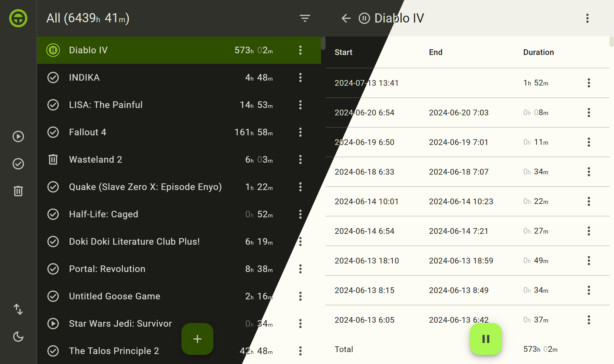

# Timer

[Timer](https://klaster1.github.io/timer-5) is a simple time tracking tool. Create a task, click "Start"/"Stop", see how much the task took, repeat.

All the data is kept in the `localStorage`, it does not leave your device, ever. To manage the data, use "Export" (to JSON) and "Import" features. A test data set can be found [here](https://gist.githubusercontent.com/Klaster1/a456beaf5384924fa960790160286d8a/raw/179c67dad43c66d48fb7c766f1e19b58df4c64cf/games.json).

Originally created back in 2011 to track my time spent on video games, it eventually turned into sorts of Todo MVC, the project gets rewritten from scracth every several years as a learning excercise. This is the fifth iteration. Some of previous Timer iterations:

- https://github.com/Klaster1/timer
- https://github.com/Klaster1/timer2

